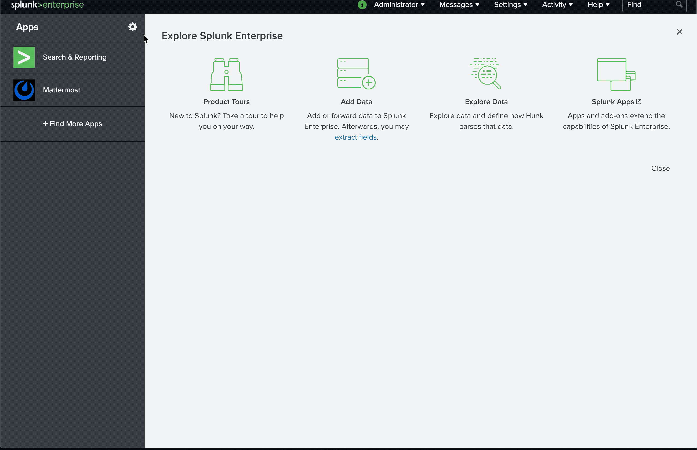
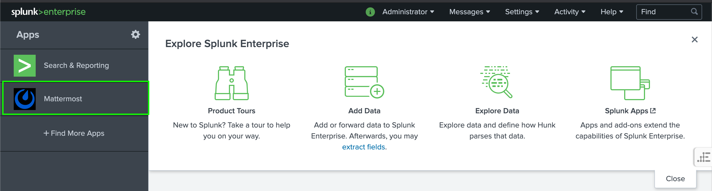
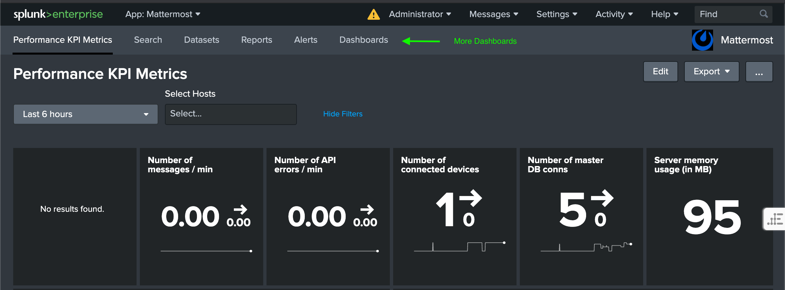

# Mattermost Metrics in Splunk

Mattermost Dashboards for Splunk that are modeled after the existing Prometheus/Grafana dashboards documented [here](https://docs.mattermost.com/deployment/metrics.html)

## Setup
### Prerequisites
This Splunk App requires the Mattermost Server metrics to be converted from the [Prometheus](https://prometheus.io/docs/concepts/data_model/) format supported natively into the [Splunk Metrics](https://docs.splunk.com/Documentation/Splunk/8.0.3/Metrics/Overview) format.  This can be achieved with the following plugin:

modinput_prometheus plugin - https://github.com/lukemonahan/splunk_modinput_prometheus which adds a new Splunk [source type](https://docs.splunk.com/Documentation/Splunk/8.0.3/Data/Createsourcetypes).

A "metrics" specific index is required.  In the repo/examples we use `mm_metrics` for the index.  Follow [Splunk documentation](https://docs.splunk.com/Documentation/Splunk/8.0.3/Indexer/Setupmultipleindexes#Create_metrics_indexes) to create a "metrics" index.

Each node in the Mattermost cluster needs to be setup as a "Prometheus" [data input](https://docs.splunk.com/Documentation/Splunk/8.0.3/Data/Configureyourinputs) that collects the Mattermost telemetry into a "metrics" index within Splunk.  For example, the file `/opt/splunk/etc/apps/mattermost-splunk-metrics/local/inputs.conf` would look something like:

```
[prometheus://mm_host1]
URI = http://docker.for.mac.localhost:8067/metrics
insecureSkipVerify = 1
interval = 15
match = *
sourcetype = prometheus:metric
index = mm_metrics
disabled = 0
```

NOTE:  Splunk data inputs can be setup through the UI, but there appears to be a bug in the `modinput_prometheus` plugin that prevents the desired [Metrics Index](https://docs.splunk.com/Documentation/Splunk/8.0.3/Metrics/GetStarted#Metrics_indexes) from being discoverable.


### Installation
Install the `mattermost-splunk-metrics` plugin through the Splunk UI


Dashboard queries depend on configuring Splunk with a specific [MACRO](https://docs.splunk.com/Documentation/Splunk/8.0.3/Knowledge/Definesearchmacros) that defines the Splunk index used to collect Mattermost metrics.

An example file located in a Docker installation at `/opt/splunk/etc/apps/mattermost-splunk-metrics/local/macros.conf` is in the repo and copied below (metrics index is `mm_metrics`):
```
[mattermost_metrics]
definition = index=mm_metrics
iseval = 0
```

## Usage

This plugin is installed as a Splunk App at the same level as the built-in "Search & Reporting" app.  

When you access the Mattermost app you will see a dashboard in the horizontal navigation bar.  The other 2 dashboards are available under the "Dashboards" tab.




## Contributing

When directly comparing the Mattermost dashboards from Grafana to Splunk, there is much less resolution on the data, but I *think* the general trends match.  More testing is needed.
 This could be improved by

### Build
Create a zipped tar file to for installation into Splunk using the provided `Makefile`:
```
$make package
```
The tarfile will be located at `dist/mattermost-splunk-metrics.tar.gz`

### Using Docker Test Setup
There is a docker-compose file that would allow you to spin up instances of:
 * Prometheus & Grafana - This is how the Splunk charts were compared to Grafana
 * Splunk - The plugin will be installed into the Splunk environment (latest docker image)
 * Changes through the UI get saved to the "local" directory structure (not "default"), which works for testing, but to contribute back any changes need to be copied back over from the directory `mattermost-splunk-metrics/local/data/ui/views` to `mattermost-splunk-metrics/default/data/ui/views`.

 These images are generally preconfigured to scrape performance metrics data from a locally running instance of Mattermost.  See [Developer Setup](https://developers.mattermost.com/contribute/getting-started/) instructions for running the Mattermost Server locally.

## TODO List
 * Most of the ["Mattermost Bonus Metrics"](https://docs.mattermost.com/deployment/metrics.html#getting-started) dashboard needs to be completed
 * Why are CPU seconds not working?  Confirm again in non-docker setup (or fix docker)
 * Add the other 2 dashboards to the nav bar
 * Fix longer range dashboard view (e.g., 7days... too many data points right now)
 * Re-test 
 * Fix the logo artwork (to have a transparent background?)
 * Improve the "Multi Select" option for hosts to handle the initial load with assuming "All" hosts, and then allow specific selection.
 * Re-test on early 7.x series version of Splunk (e.g., 7.2).  Early development was done on Splunk 7.2, but finished on 8.0.


## Future ideas
 * Post alerts and dashboards to Mattermost channels
 * Add log correlation to the dashboards.
 * Can some of the search span periods be made into a parameter or macro so users can configure the period to match the way the prometheus data inputs are configured in Splunk.
